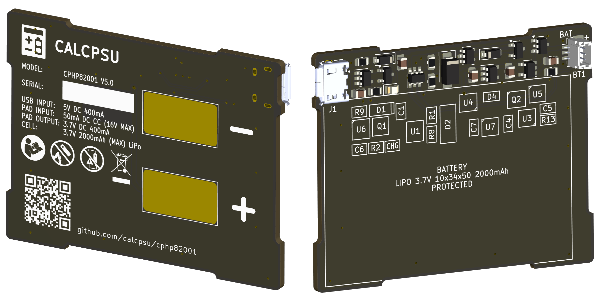
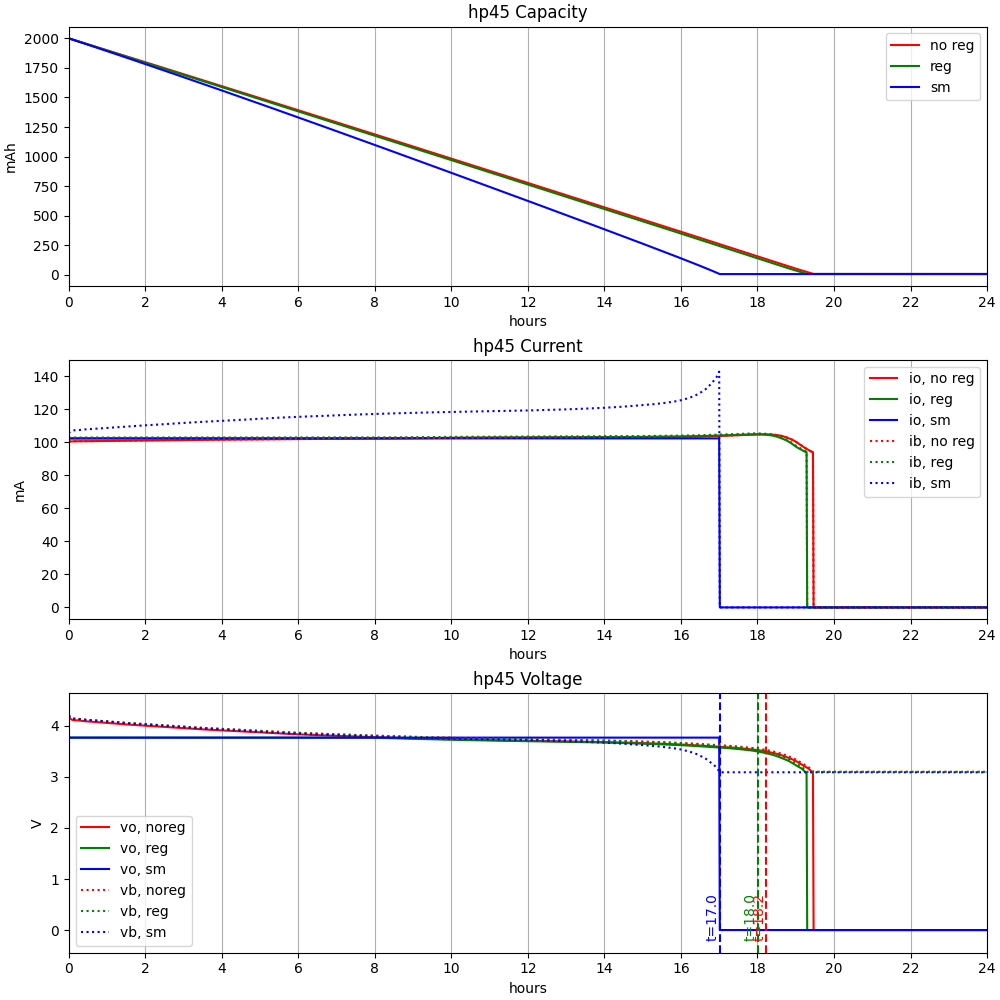

# CalcPack HP 82001

A Li-Po battery replacement design for HP35/HP45/HP55/HP65/HP67 calculators. The original batteries had ~ 500mAh capacity, while modern Ni-MH replacements are typically ~1500mAh.

Li-Po has the advantage of far reduced self-discharge in comparison to Ni-MH, which is an advantage for an intermittently-used device. Even with similar mAh capacity, we can expect longer battery life.

Ni-MH / Ni-CD batteries are notorious for leaking. While Lithium Ion batteries are notorious for self-immolation, a well protected Li-Po battery (particularly in a low current application like this) should be able to be made very safe.

## Features / design goals:
- Fit into existing compartment with no modifications
- Similar or ideally exceed capacity of standard Ni-Cd or Ni-MH 3xAA types (1200~2200mAh)
- Dual charge - USB (externally) or in-place using original HP charger
- Battery charge control and protection
- Maximise battery life:
    - Minimise Iq to maximise time between charges (shelf time)
    - Minimise voltage drop / series resistance of circuits to maximise run time
    - Optimise Vout to minimise calculator power consumption

## References 
This has been inspired by the below reference projects:
 - https://www.edn.com/classic-hp-35-calculator-comes-back-to-life/
   - GOOD: Regulated (see reasoning in the article, and discussion below)
   - BAD: Has no charging circuit / must remove to charge
   - BAD: Cannot connect HP charger (would cause dangerous overcharge condition; best case trip battery OC protection)
 - https://hackaday.io/project/175815-classic-hp-calculator-lipo-battery-pack
   - GOOD: Has on-board charge controller
   - BAD: Has no regulation
   - GOOD: Can connect HP charger, but
   - BAD: Unable to charge from HP charger / must remove to charge

## Key Components
 - Battery:
     - 10x34x50mm lipo pouch cell. These also include a DW01A/FS8205 protection circuit.
 - Charge controller: [BQ21040](https://www.ti.com/lit/ds/symlink/bq21040.pdf)
     - Wide voltage input range (over voltage protected)
     - Clever voltage foldback mode (which will help with constant current supply charging)
     - Variable current setting
     - Safety timer (10h) and 10% termination current
 - OPTION 1: Regulator: [TLV75801](https://www.ti.com/lit/ds/symlink/tlv758p.pdf)
     - Ultra low dropout (~30mV)
     - 500mA current limited (enough for HP67 card read/write at ~400mA for a few seconds)
     - Very low Iq for a regulator (25uA at idle, assuming Vb > Vo; only 400uA or so at full current)
     - Note: option eliminated as of REV5; if you're really keen for a regulated version please to check out rev4.
 - OPTION 2: Current Limiter: [MCP380SNT](https://www.onsemi.com/pdf/datasheet/ncp380-d.pdf)
     - Designed as a USB input current limiter, also works for LiPo cell voltage range
     - 800mA limiting, short circuit protection
     - Provides the similar current limiting capability as the TLV75801 with minimal additional quiescent current; allows retaining this function/protection in case of an unregulated option.
 - Output protection diode: [MAX40203](https://www.analog.com/media/en/technical-documentation/data-sheets/MAX40203.pdf)
     - Low voltage drop (~40mV) ideal diode
     - Low leakage and low Iq (<0.5uA)
 - Undervoltage protection: [APX809S-31SA](https://www.diodes.com/assets/Datasheets/APX809S-810S.pdf)
     - Pre-set with 3.1V threshold
     - Output used to shutdown regulator, shutting off load and vastly reducing Iq
     - Actual protective disconnection of battery done at ~2.5V by battery pack protection circuit (typically DW01A/FS8205)
 - Input overvoltage protection: [NCP360SNT](https://www.onsemi.com/pdf/datasheet/ncp360-d.pdf)
     - Cuts off USB input for overvoltage condition (note that 2x rated voltage is required by compliance test standard EN38.3 T.7, required for transport of lipo batteries in USA/EU).
     - Input via pads does not require OVP - it can tolerate the required 22v/100mA required condition.

## Function Description

### Discharging, calculator on:
 - B+ supplies cell voltage via current limiting IC
 - Output delivered to calculator via ideal diode U3
 - Vout at 3.8V is below threshold for U4 (4.4V), Q2 is off and VCC is 0V (charging IC shutdown completely)
### Charging, USB:
 - VBUS supplies VCC via U6 and D1
 - Presence of VBUS pulls prog down via Q1, charge controller now charges battery at higher current (0.2C target)
 - Physically not possible to do inside the calculator, can assume calculator is not connected during charging.
   - Although, body diode of Q2 and U3 would enable effective load sharing in this case, with output at about 4V (still well within acceptable limits for the calculator). This could be used for a future alternative in-system charging connection (e.g. a modified charging circuit, wireless charging, etc.)
### Charging, HP charger:
 - HP charger supplies 50mA constant current, up to 16V (!!). With the original NiCads, these acted as a voltage clamp (float charge about 1.43V/cell = 4.3V) - we need to replace this function.
    - With no charging current, voltage Vout rises until U3 switches off.
    - Will continue to rise until clamped by D2 (this should be low enough to protect HP65/67 sense chip from harm with extended application, but too low will result in excessive Iq as the voltage nears the zener's knee). Reviewing available documents, 4.3V is definitely OK, 6.25V might be survivable (as this is Vss normally). I have tested with 5.6V zener, and this has shown no negative impact to any calculators (particualrly the HP-67, where the sense chip sees this voltage, albeit when off).
    - Exceeding 4.4V for 240ms, U4 activates and connects Vout to Vcc via Q2 and D4.
    - D4 ensures that U1 throttles current (Vcc below 4.3V) before U4 cuts off supply (VOUTF 4.4V), maximising utilisation of limited constant current supply. See further explanation in [issue #5](https://github.com/calcpsu/cphp82001/issues/5).
    - U1 begins charge cycle, delivering up to 50mA to battery.
    - On charge termination, VCC current is minimal (10's of uA), all 50mA will be running through D2 (~0.25W power; using biggest one I can fit to keep temperature down). Voltage will be at the zener voltage (5.6V).
 - HP35/45/55 calculators do not draw current when on - supplied separately by HP AC adapter, the calculator supply is physically disconnected from the charging circuit.
 - HP65/67 with card reader: card reader may draw from battery supply. The sense chip is connected to the battery continuously, and will see up to the 5.6V float voltage. In case the calculator is operated and this draws current, the CC supply voltage will drop until U4 shuts off current to the charge circuit, resetting the charge cycle. When VOUT drops below B+, U3 activates, and card reader is powered from the current limiter (B+). As the AC adapter is not sufficient to run the card reader, this is the least worst outcome available.
### Battery Exhausted:
 - HP35 shows low battery (decimal points) indication at V+ of 3.50V.
   - This represents about 6-7% charge state of LiPo
   - User may switch off and recharge now...
 - HP67 will show indicator at about 3.60V; similar to above but a little more margin.
 - HP35 will cease to function at ~3.25V, still draws ~75mA
   - User probably should switch off and recharge now...
 - U4 protects battery at VB+ = 3.1V, by disabling the regulator or current limiting IC. Iq should be ~10uA.
 - If left for a _really_ long time, VB+ may reduce to 2.5V, which should trigger battery pack protection circuit and fully disconnect the battery. Plugging in (turning on charge controller, which will do a battery detection routine and reset the protection circuit) will reset.

## Assembly Notes ##

Refer to the schematic for details. The following notes are worth considering if building your own:
* The design allows either regulated or unregulated option.
  - For regulated (best for HP35), U2 regulator provides regulation and current limiting - U7 is not required and can be omitted and bypassed.
  - For unregulated (best for all later types), U2 is omitted and bypassed, and U7 is added to provide current limiting
* A 3-pin JST-SH (1.0mm pitch) connector is used for the battery. 1=pos, 2=temp, 3=neg
  - R13 is in parallel with TS pin NTC thermistor. If the battery does not a provide NTC thermistor (white wire, 3 pin connector), leave pin2 open and install R13=10k.
  - Note datasheet indicates 237k resistor prevents timer disable mode, but this also prevents charging without thermistor
    
| R13 | Battery With Temperature Sensor | Battery Without Temperature Sensor |
| --- | --- | --- |
| Omit | 🟢 10% Current Charge Termination   🟢 10h Charge Timeout | 🔴 10% Current Charge Termination   🔴 10h Charge Timeout |
| 10k  | ⚠️ Will not charge T>25C   ⚠️ Will charge T<0C  | 🟢 10% Current Charge Termination   🟢  charge timeout |

* Two case designs are provided, one with and one without an LED hole. If you 3D print with a transluscent material, the hole is not needed!

## Notes on optimisation:

Addition of a series regulator is not an immediately obvious means to maximise efficiency. I've measured the HP-35 increases current consumption as voltage rises (this is most likely a result of the way the LEDs are driven with fixed-duty inductive energy, this appears as brighter leds). Even accounting for the linear loss and Iq of the regulator circuit, total power consumption decreases as the regulator voltage decreases (down to about 3.6V, the minimum to operate the calculator reliably). The newer models (HP-45, HP-67) do the opposite - the current drops as the voltage increases, which indicates a more typical profile for a switchmode converter. The HP-67 has a card reader with a motor; this draws around 400mA when reading/writing a card, direct from battery. To allow for a little drop in the system, the regulator voltage needs to be a touch higher (looks like about 3.8V works consistently).

### Why not a switching regulator?

In theory, replacing the series linear regulator with a switching regulator may allow use of the battery capacity right down to 3.1V, and more efficiently use the currently wasted energy of the full battery (VB+ > 3.78V) currently being dissipated by the linear reg.

I've investigated using a MIC2250 step-up regulator, which has a surprisingly low Iq (55uA, not switching), and could provide a consistent output voltage right down to the end of the battery capacity (Vb=3.0V). At the currents needed, this can be around 87% efficient. This would provide a consistent voltage right up until shutdown. While this might be good particularly for the HP-67 card reader, it has the disadvantage of skipping the calculator's built-in low battery indication - the power supply unit would completely shutdown without any warning with a low battery.

### Model of 3 options

I've done a simulation of the 3 options:

  1. No regulator (default - calculator supplied with battery voltage via MAX40203 diode)
  2. Linear regulator (TLV75801, set to 3.80V)
  3. Switchmode step-up regulator (MIC2250, set to 3.80V also)

For each, the model calculates the change in output voltages given the battery state, calculator and power supply current draw, and iterates until the battery (2000mAh) is exhausted. The calculator load is measured from 3 sample calculators (HP-35, HP-45 and HP-67), reflecting the calculator being left on in the default display ("0." or "0.00" depending on the model), and accounts for the changing current with changing supply voltage. Results are shown below.

In summary, a regulated design gains a slight advantage in run time for the HP-35, while slightly reducing run time for HP-45 and HP-67. The switchmode design is actually best for the current-hungry HP-67, but not by a significant amount, and at the cost of higher quiescent current (shortening standby time significantly).

In conclusion, the regulated design provides a slight advantage for the HP-35 based on this model, however the unregulated design (with addition of necessary output short-circuit protection / current limiter) can be expected to be ideal for other models. Prototype testing with rev 3.5 showed the unregulated design works well in all the calculators, and the regulated design had noticeably faster self-discharge in practice, particularly as the quiescent current is larger than anticipated in dropout mode. As such, further designs have eliminated the regulator in favour of improved board layout and ease of use.

#### Results summary (t in hours)

#### HP-35

#### HP-45

#### HP-67

## Community Builds ##
Built one? Send me some pics and I'll share here!
### [Milo van der Zee](https://github.com/MilovdZee) ###

## License

This work is licensed under a
[Creative Commons Attribution-NonCommercial-ShareAlike 4.0 International License][cc-by-nc-sa].

[![CC BY-NC-SA 4.0][cc-by-nc-sa-image]][cc-by-nc-sa]

[cc-by-nc-sa]: http://creativecommons.org/licenses/by-nc-sa/4.0/
[cc-by-nc-sa-image]: https://licensebuttons.net/l/by-nc-sa/4.0/88x31.png
[cc-by-nc-sa-shield]: https://img.shields.io/badge/License-CC%20BY--NC--SA%204.0-lightgrey.svg
